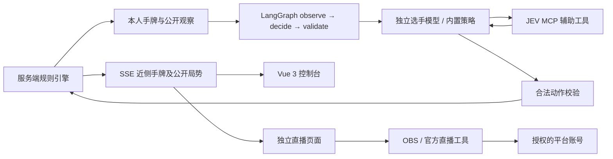

# 架构与上线说明

## 数据流

`server/rules.ts` 是裁判；`server/agents.ts` 生成模型观察及适配；`server/index.ts` 串联决策图、控制与广播；`src/ArenaScene.vue` 提供程序化 Q 萌角色；`src/App.vue` 作为路由出口；`src/StudioView.vue` 提供上级管理页面，`src/ArenaView.vue` 是独立对局、直播与回放视图。`shared/types.ts` 提供两端共享状态。

服务端单次仅一个决策任务。暂停会作废尚未提交的结果；重置及配置在忙碌时拒绝，防止旧任务写入新局。模型不可直接调用出牌接口，最终动作必须来自规则引擎。API Key 从环境变量读取，只发送给该座位配置的服务商；不回传给浏览器、不写进回放、不打印响应正文。

## API

| 路径              | 作用                                       | 控制口令     |
| ----------------- | ------------------------------------------ | ------------ |
| GET /api/health   | 存活状态                                   | 无           |
| GET /api/state    | 公开局势 + 近侧 0 号手牌，其他三家不含手牌 | 无           |
| GET /api/events   | SSE 公开局势 + 近侧手牌                    | 无           |
| POST /api/control | start / pause / step / reset / next        | 若设置则必须 |
| PUT /api/config   | 四座位及节奏配置                           | 若设置则必须 |
| POST /api/test    | 单座位真实连接测试                         | 若设置则必须 |
| GET /api/inspect  | 四家手牌                                   | 若设置则必须 |
| GET /api/replay   | 本局完整回放                               | 若设置则必须 |

对外监听必须设置 `CONTROL_TOKEN`，使用 `Authorization: Bearer ...`。浏览器口令存当前会话 sessionStorage，不进 URL。后台不向外暴露 `.env` 或 `data/`，仅服务构建后的 `dist/`。

## 生产化演进

当前交付可运行单房间首版。长期无人值守上线应增加：

1. 比赛状态／事件持久化与重启恢复，原子保存、断点恢复、模型调用幂等。
2. 模型端点白名单、单供应商费用上限、并发／限流／退避、熔断与延迟指标。目前上游 5xx 最多重试一次，仍失败才策略兜底；尚无费用上限和长期熔断。
3. 控制台账号体系、HTTPS 反向代理、独立观众与管理域、权限和审计日志。当前控制口令适合本机／受信任局域网使用。
4. 多房间、比赛编排、Elo／胜率评估、不同模型策略对照。JEV 单实例共享推理，应根据实际吞吐设置行动间隔。
5. 专业美术资产、骨骼动画、表情与口型、稳定 TTS、音频混音、压缩素材与 GPU 性能监测。
6. 获平台授权后接入推流与弹幕接口，维护推流密钥、自动重连、多平台差异。平台权限未知时保持通过官方工具采集这一通用路径。

## 资料

- [LangGraph JavaScript Graph API](https://docs.langchain.com/oss/javascript/langgraph/graph-api)
- [MCP 客户端规范与说明](https://modelcontextprotocol.io/docs/develop/build-client)
- JEV 现场说明：`http://10.0.10.2:8019`，Streamable HTTP `/mcp`、Bearer 个人 Key、`jev_decide`。控制台密码不应进项目源码。

`data/agents.json` 持久化角色配置、行动间隔与自动下一局设置。对局也会重启为新比赛，已有每局回放仍保留。这样明确区分可演示交付与生产持久化。

## 路由与连续比赛

Vue Router 使用 history 模式：`/studio` 为管理父路由，其下包含大厅、模型配置、直播及回放；`/arena` 是独立全屏对局路由。Vite 与生产 Express 的 SPA fallback 支持直接刷新深层 URL。部署到其他静态托管时也须设置 fallback。

公开状态由 `server/public-state.ts` 统一构建，只暴露 0 号 `visibleHand`。模型观察由服务端独立构建，观众公开单家手牌不改变模型的信息边界。回放视角按初始近侧手牌扣除已出的牌，不从直播接口获取其他私有手牌。

局末自动续局用服务端 `nextRoundAt` 时间戳控制，停留 8 秒后执行贡还并恢复 running。浏览器只显示倒计时，不驱动发牌，多个浏览器不会重复开局。暂停取消该时间戳，单步结束不启动倒计时，比赛打过 A 不会继续。
